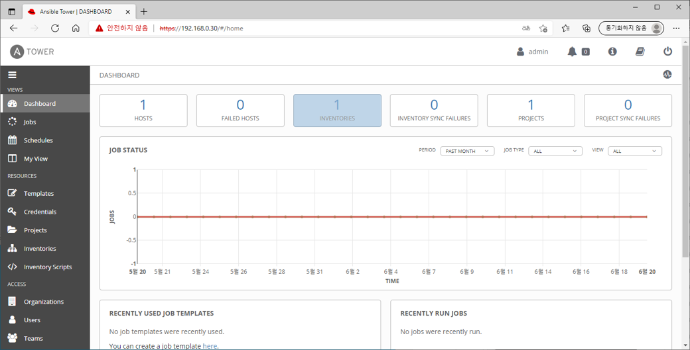
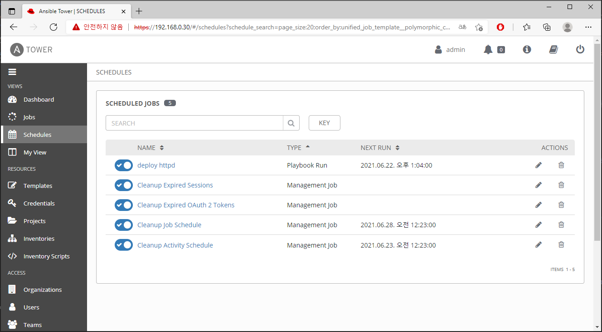
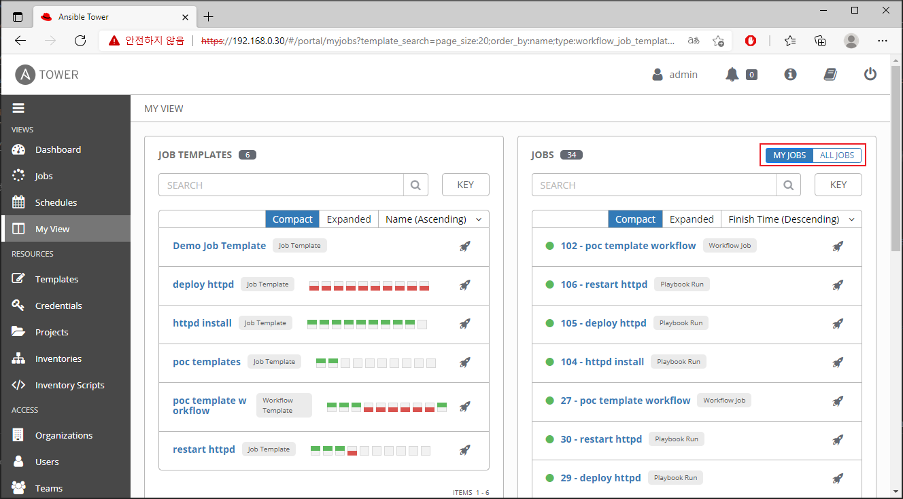
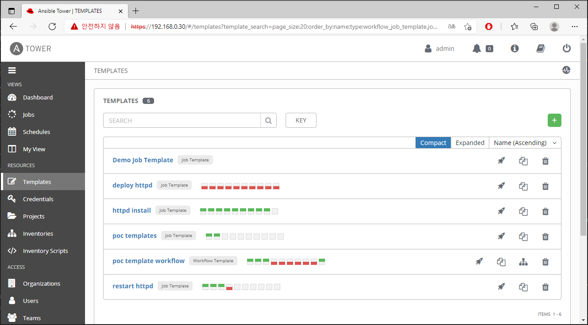
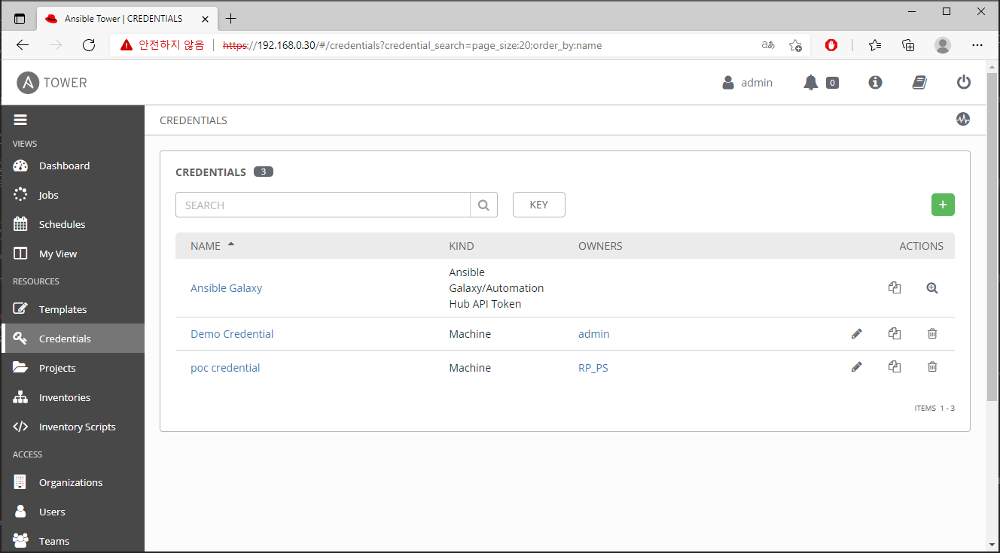
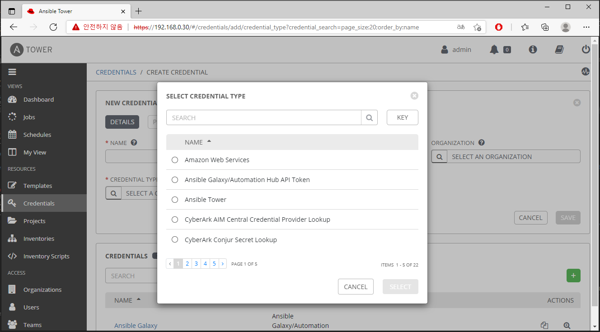
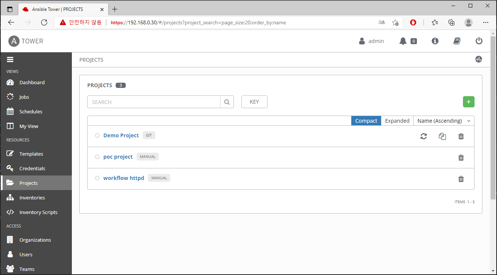
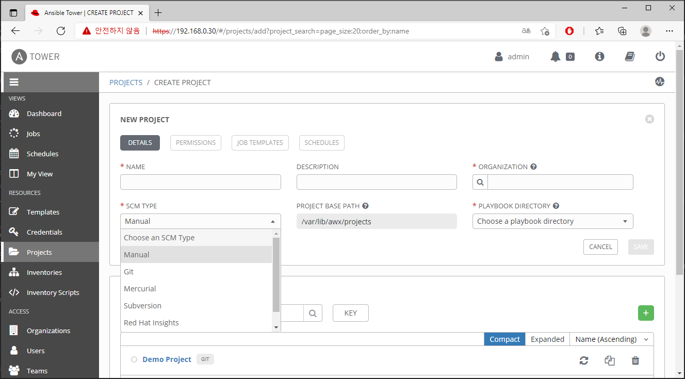

# TOWER DASHBOARD
 
## 1. Dashboard
> Hosts, Inventories, projects정보와 최근 사용한 템플릿의 작업 성공, 실패에 대한 정보를 그래프화 해서 보여준다.

## 2. Jobs View
> 템플릿의 작업 상태를 보여준다.  
>  버튼을 클릭하여 작업을 재실행,  버튼을 클릭하여 보여지는 작업을 제거 할 수 있다.

## 3. Schedules
> 생성한 템플릿에 등록한 모든 예약작업이 표시된다.  
> 이름 옆에있는 토글 버튼을 통해 Schedule ON/OFF가 가능하며,  
> 버튼을 클릭하여 Schedule의 수정,  버튼을 클릭하여 Schedule의 제거가 가능하다.

## 4. My View
> Tower에 대한 고급 지식이 필요하지 않은 일반 사용자를 위한 단순화된 인터페이스이다.  
> 권한이 있는 템플릿을 실행하거나, 실행된 작업의 간단한 뷰를 제공한다.  
> **MY JOBS** : 내가 실행한 작업을 보여준다.  
> **ALL JOBS** : RBAC 권한에 따라 팀원이 실행한 전체 작업을 보여준다.

## 5. Templates
> 템플릿을 생성하거나, 생성된 템플릿의 목록을 보여준다.  
> 생성된 템플릿의  버튼을 클릭하여 작업을 실행하거나,  버튼을 클릭하여 템플릿을 복제 할 수 있으며,  버튼을 클릭하면 생성된 템플릿의 제거가 가능하다.

## 6. Credentials
> Credential을 생성하거나, 생성된 Credential의 목록을 보여준다.  
> 생성된 Credential의  버튼을 클릭하여 수정하거나,  버튼을 클릭하여 Credential을 복제 할 수 있으며,  버튼을 클릭하면 생성된 Credential의 제거가 가능하다.  
> 일반적으로 Ansible Tower는 SSH를 사용하여 원격 호스트에 연결하며, 경우에 따라 여러가지 Credential Type(Amazon AWS, MS Azure, GCE 등) 을 선택하여 사용할 수 있다.

## 7. Project
> 프로젝트를 생성하거나, 생성된 프로젝트의 목록을 보여준다.  
> 플레이북의 집합으로 SCM TYPE기준 Manual한 설정은 Base Path(/var/lib/awx/projects)에 배치하여 사용되며, 여러가지 SCM TYPE(GIT, Subversion 등)을 선택하여 사용할 수 있다.

## 8. Inventories
> 인벤토리를 생성하거나, 생성된 인벤토리 목록을 보여준다.  
> dfsdfsdf
