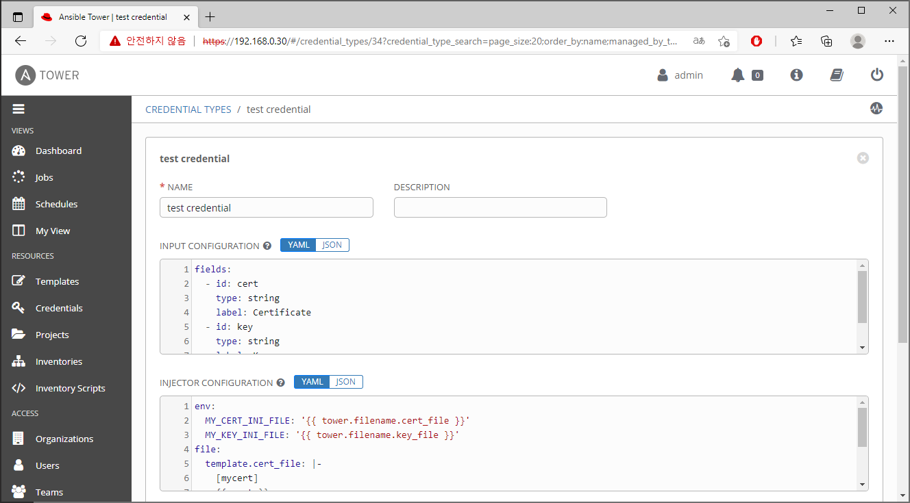

# TOWER DASHBOARD
 
## 1. Dashboard
> Hosts, Inventories, projects정보와 최근 사용한 템플릿의 작업 성공, 실패에 대한 정보를 그래프화 해서 보여준다.  

## 2. Jobs View
> 템플릿의 작업 상태를 보여준다.   
 버튼을 클릭하여 작업을 재실행,  버튼을 클릭하여 보여지는 작업을 제거 할 수 있다.  

## 3. Schedules
> 생성한 템플릿에 등록한 모든 예약작업이 표시된다.  
> 이름 옆에있는 토글 버튼을 통해 Schedule ON/OFF가 가능하며,  
> 버튼을 클릭하여 Schedule의 수정,  버튼을 클릭하여 Schedule의 제거가 가능하다.  

## 4. My View
> Tower에 대한 고급 지식이 필요하지 않은 일반 사용자를 위한 단순화된 인터페이스이다.  
> 권한이 있는 템플릿을 실행하거나, 실행된 작업의 간단한 뷰를 제공한다.  
> **MY JOBS** : 내가 실행한 작업을 보여준다.  
> **ALL JOBS** : RBAC 권한에 따라 팀원이 실행한 전체 작업을 보여준다.  

## 5. Templates
> 템플릿을 생성하거나, 생성된 템플릿의 목록을 보여준다.  
> 생성된 템플릿의  버튼을 클릭하여 작업을 실행하거나,  버튼을 클릭하여 템플릿을 복제 할 수 있으며,  버튼을 클릭하면 생성된 템플릿의 제거가 가능하다.  

## 6. Credentials
> Credential을 생성하거나, 생성된 Credential의 목록을 보여준다.  
> 생성된 Credential의  버튼을 클릭하여 수정하거나,  버튼을 클릭하여 Credential을 복제 할 수 있으며,  버튼을 클릭하면 생성된 Credential의 제거가 가능하다.  
  
> 일반적으로 Ansible Tower는 SSH를 사용하여 원격 호스트에 연결하며, 경우에 따라 여러가지 Credential Type(Amazon AWS, MS Azure, GCE 등) 을 선택하여 사용할 수 있다.  

## 7. Project
> 프로젝트를 생성하거나, 생성된 프로젝트의 목록을 보여준다.  
> 프로젝트란 플레이북의 집합으로 SCM TYPE기준 Manual한 설정은 Base Path(/var/lib/awx/projects)에 배치하여 사용되며, 여러가지 SCM TYPE(GIT, Subversion 등)을 선택하여 사용할 수 있다.  

## 8. Inventories
> 인벤토리를 생성하거나, 생성된 인벤토리 목록을 보여준다.  
> 생성된 인벤토리의  버튼을 클릭하여 수정하거나,  버튼을 클릭하여 인벤토리를 복제 할 수 있으며,  버튼을 클릭하면 생성된 인벤토리의 제거가 가능하다.  
> 인벤토리 생성 방식에는 Inventory, Smart Inventory 두가지가 있다. 일반적으로 Inventory를 사용하게 되며, 생성 후 User를 할당하거나 Group을 생성하여 Host를 등록하는 방식으로 사용된다. Smart Inventory의 경우 이미 생성된 Inventory내 Host들을 필터를 통하여 등록하는 방식으로 사용된다.  

## 9. Inventory Script
> Tower에서는 기본적으로 Amazon AWS, Google Compute Engine 등의 클라우드에서 인벤토리를 동기화 하기 위한 Dynamic Inventory 기능을 지원한다.  
> Tower에서 제공하는 기능 외 동기화가 필요하다면 Custom Inventory Script(Python, Bash)를 통하여 직접 작성하여 사용할 수 있다.  

## 10. Organizations
> 조직을 생성하거나, 생성된 조직을 보여준다.  
> 생성된 조직의  버튼을 클릭하여 수정하거나,  버튼을 클릭하면 생성된 조직의 제거가 가능하다.  
> Tower에서 가장 상위 계층에 해당되며 새로운 조직을 생성하고 생성한 조직에 등록된 사용자 및 관리자를 설정 할 수 있다.  

## 11. Users
> 사용자를 생성하거나, 생성된 사용자를 보여준다.  
> 생성된 사용자의  버튼을 클릭하여 수정하거나,  버튼을 클릭하면 생성된 사용자의 제거가 가능하다.  
> Tower에서 가장 하위 계층에 해당되며 새로운 사용자를 생성하고 아래 세가지 유형의 권한을 할당 할 수 있다.  
> **Normal User** : 할당된 개체에 읽기, 쓰기, 실행 권한을 가진다.  
> **System Auditor** : 모든 개체에 읽기권한을 가진다.  
> **System Administrator** : Super User로서, Tower에 대한 모든 권한이 주어진다.  

## 12. Teams
> 팀을 생성하거나, 생성된 팀을 보여준다.  
> 생성된 팀의  버튼을 클릭하여 수정하거나,  버튼을 클릭하면 생성된 팀의 제거가 가능하다.  
> Tower에서 사용자 다음 계층에 해당되며 새로운 팀을 생성하고 앞서 생성한 사용자를 팀에 등록 할 수 있다.  

## 13. Credential Types
> Tower에서 기본으로 제공되는 자격증명 외에 YAML/JSON 형식으로 사용자가 직접 자격증명을 정의하는 기능을 제공한다.  

## 14. Notifications
> 알림을 생성하거나, 생성된 알림을 보여준다.  
> 생성된 알림의  버튼을 클릭하여 수정하거나,  버튼을 클릭하여 알림 테스트를 수행 할 수 있으며,  버튼을 클릭하여 알림을 복제 할 수 있고,  버튼을 클릭하면 생성된 알림의 제거가 가능하다.  
> Email, Slack, Webhook 등을 사용하여 알림 템플릿을 생성한 후 알림을 지원하는 개체에 설정하여 사용할 수 있다.  

## 15. Management Jobs
> Tower에서 제공하는 작업으로, 오래된 데이터를 정리하는데 도움을 주는 작업의 모음이다.  
> Tower의 데이터베이스에서 사용하는 스토리지를 줄여야 하는 경우 이를 사용 할 수 있다.  
>  버튼을 클릭하여 즉시 수행하거나,  버튼을 클릭하여 Schedule 수정이 가능하며,  버튼을 클릭하여 알림을 받아볼 수 있다.  
> **Cleanup Activity Stream** : 지정된 일수보다 오래된 활동 기록 제거  
> **Cleanup Expired OAuth 2 Tokens** : 만료된 OAuth 2 액세스 토큰 제거 및 토큰 새로고침  
> **Cleanup Expired Sessions** : 데이터베이스에서 만료된 브라우저 세션 제거  
> **Cleanup Job Details** : 지정된 일수보다 오래된 작업 기록 제거  

## 16. Instance Groups
> 클러스터 환경에서 전체 클러스터를 공유해서 사용하는 방식 외에, Instance Groups는 클러스터를 그룹화 해서 사용하는 기능을 제공한다.  

## 17. Applications
> 외부 어플리케이션을 위한 토큰 기반 인증 생성 및 구성이 가능하며, OAuth2를 사용하여 로그인 정보(ID/PASSWORD)를 공개하지 않아도 특정 데이터를 어플리케이션과 공유할 수 있다.  

## 18. Settings
> Tower의 구성환경 설정이 가능하다.  
> **Authentication** : Github, Google, LDAP과 같은 다양한 인증 유형을 통해 로그인 설정을 할 수 있다.  
> **Jobs** : Job과 관련된 세부 설정사항을 수정할 수 있다. 예를들어 Job이 실행되는 경로, 설정 가능한 최대 Schedule가능 개수 등이 있다.  
> **System** : Tower 호스트에 대한 기본 URL을 정의하거나, Active Stream을 활성/비활성화 하고, 로깅 옵션을 설정 할 수 있다.  
> **User Interface** : Tower 제품을 개선하기 위한 사용자 데이터를 자동으로 수집하는 설정을 하거나, 로그인 화면에서 보여지는 로고, 메시지 인포를 수정할 수 있다.  
> **License** : Tower의 라이센스를 등록하거나, 등록되어진 라이센스의 정보를 볼 수 있다.  

