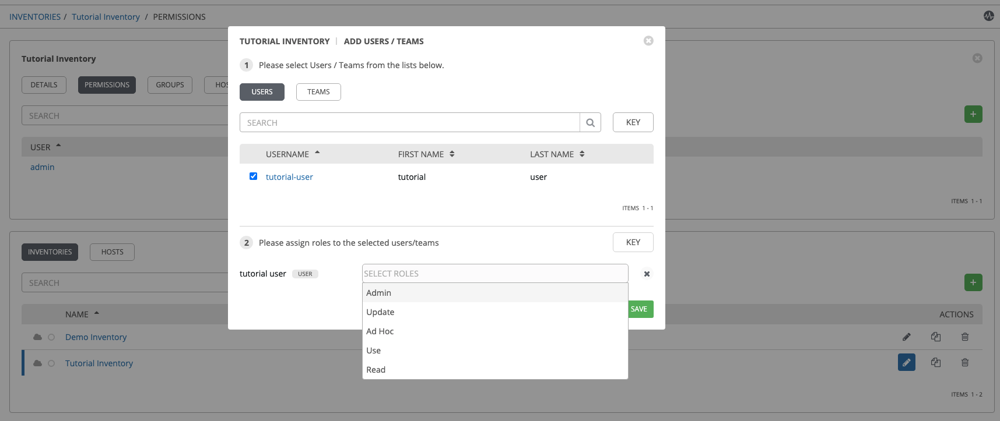
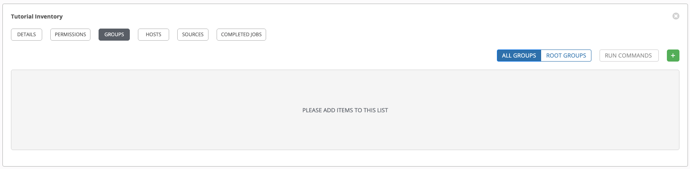
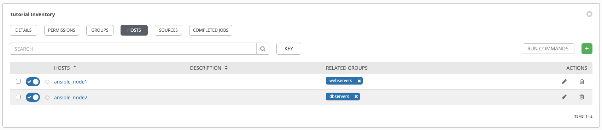

# MANAGE INVENTORY

## 1. Inventory 관리
> 작업 대상 노드의 집합으로 그룹,호스트를 관리 할 수 있다.

### 1. Inventory 등록

> Menu > Inventories   
> Inventory 선택 후 상단 Permission 에서 Team 또는 User 별 Role(Admin,Update,Ad Hoc, Use, Read) 설정이 가능하다.

### 3. Hosts 등록 

> Inventory 선택 > Hosts   
> Inventories 의 Hosts 을 관리한다.
 
 

### 2. Group 등록 

> Inventory 선택 > Groups   
> Inventories 의 Group 을 관리한다.

> Inventory 선택 > Groups > Group 선택 > Hosts,Groups

> Inventories > Inventory 선택 > Hosts
