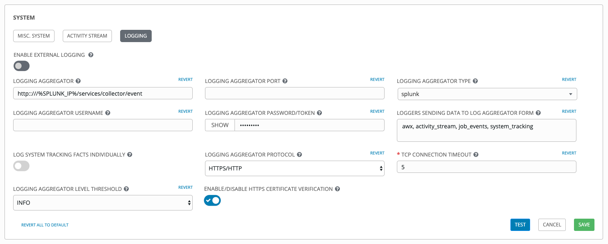
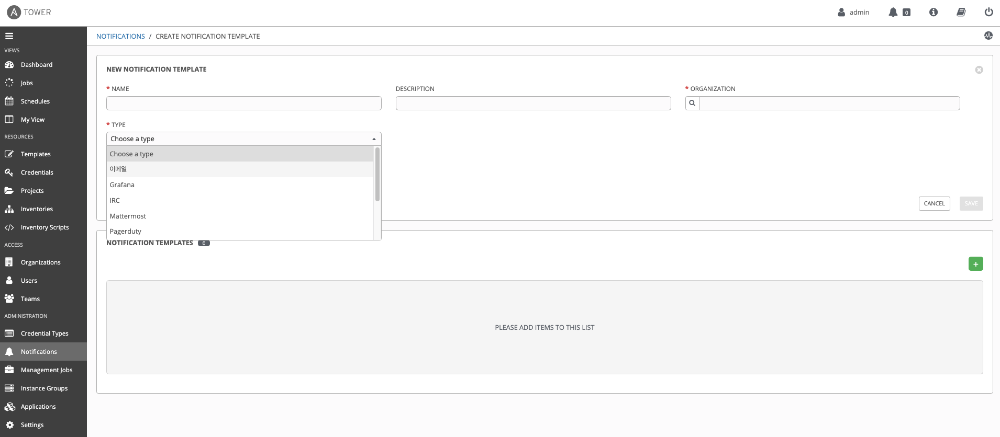
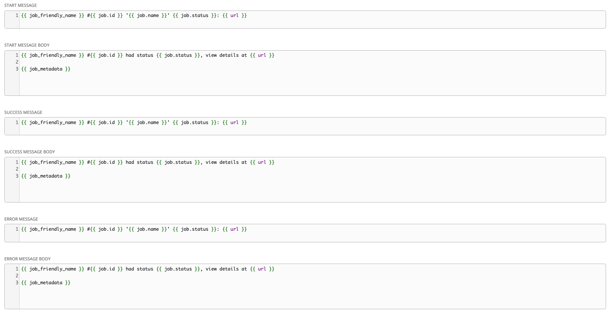

# Tower Logging

## 1. Tower Logfiles
> 타워는 두개의 위치에서 로그 파일을 관리한다.
- /var/log/tower/
- /var/log/supervisor/

## - "/var/log/tower" 에서 위치하는 파일은 아래와 같다.

- **callback_receiver.log:** captures callback receiver logs that handles callback events when running ansible jobs.

- **dispatcher.log:** captures log messages for the Tower dispatcher worker service.

- **management_playbooks.log:** captures the logs of management playbook runs, the isolated job runs like copying the metadata, etc.

- **rsyslog.err:** captures rsyslog errors authenticating with external logging services when sending logs to them.

- **task_system.log:** - captures the logs of tasks that Tower is running in the background, such as adding tower cluster instances and logs related to information gathering/processing for analytics, etc.

- **tower.log:** captures the log messages such as runtime errors that occur when the job is executed.

- **tower_rbac_migrations.log:** captures the logs for rbac database migration or upgrade.

- **tower_system_tracking_migrations.log:** captures the logs tower system tracking migration or upgrade.

- **wsbroadcast.log:** captures the logs of websocket connections in the tower nodes.

## - "/var/log/supervisor/" 에서 위치하는 파일은 아래와 같다.

- **awx-callback-receiver.log:** captures the log of callback receiver that handles callback events when running ansible jobs, managed by supervisord.

- **awx-daphne.log:** captures the logs of Websocket communication of WebUI.

- **awx-dispatcher.log:** captures the logs that occur when dispatching a task to a tower instance, such as when running a job.

- **awx-rsyslog.log:** captures the logs for rsyslog service.

- **awx-uwsgi.log:** captures the logs related to uWSGI, which is an application server.

- **awx-wsbroadcast.log:** captures the logs of websocket service that is used by tower.

- **failure-event-handler.stderr.log:** captures the standard errors for /usr/bin/failure-event-handler supervisord’s subprocess.

- **supervisord.log:** captures the logs related to supervisord itself.

 
## 2. Tower Logging and Aggregation
> Tower는 Logs Splunk, Loggly, Sumologic 과 같은 외부 로그 수집 서비스로 로그를 전송할수 있다.

> Menu > Settings > SYSTEM > LOGGNG   
> splunk example>  
> 

## 3. NOTIFICATION
> Tower는 이메일,Grafana,IRC,Slack 등 다양한 형태의 알람을 제공한다.

> Menu > Notifications   
> 

> jinja2 형식의 사용자 정의 알람 템플릿 설정이 가능하다.
> 

> **:link: Referer** :  
> https://docs.ansible.com/ansible-tower/latest/html/administration/logfiles.html 
> https://docs.ansible.com/ansible-tower/latest/html/administration/logging.html