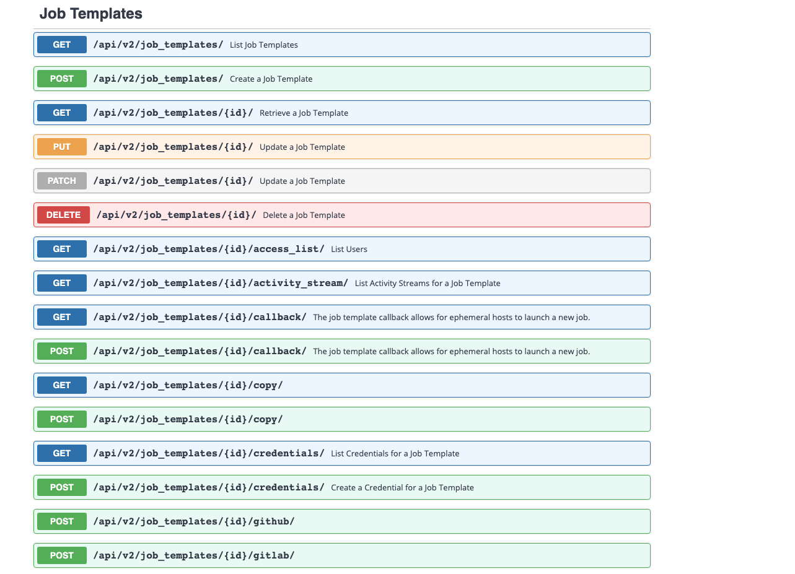

# Tower API
 
> **ℹ️ Info** : For your information! <BR>
> Ansible Tower 는 Rest API 를 제공한다. <BR>

본 튜토리얼은 tower api 를 이용하여 Job Template 를 실행하는 내용을 포함하고 있다.

# 1. Job Template API 확인 

> **:link: Referer** : 
> https://docs.ansible.com/ansible-tower/3.8.3/html/towerapi/api_ref.html <BR>
> 

# 2. Job Template 리스트 확인
> Job Template 목록을 확인한다.
```
# curl -u "admin:rplinux" -k https://10.65.40.19/api/v2/job_templates/ 
{"count":5,"next":null,"previous":null,"results":["id":12,"type":"job_template","url":"/api/v2/job_templates/12/","related":{"named_url":"/api/v2/job_templates/Tutorial Job Template++Tutorial ORG/","created_by":"/api/v2/users/1/","modified_by":"/api/v2/users/1/","labels":"/api/v2/job_templates/12/labels/","inventory":"/api/v2/inventories/4/","project":"/api/v2/projects/11/","organization":"/api/v2/organizations/3/","credentials":"/api/v2/job_templates/12/credentials/","last_job":"/api/v2/jobs/179/","next_schedule":"/api/v2/schedules/6/","jobs":"/api/v2/job_templates/12/jobs/","schedules":"/api/v2/job_templates/12/schedules/","activity_stream":"/api/v2/job_templates/12/activity_stream/","launch":"/api/v2/job_templates/12/launch/","webhook_key":"/api/v2/job_templates/12/webhook_key/","webhook_receiver":"","notification_templates_started":"/api/v2/job_templates/12/notification_templates_started/","notification_templates_success":"/api/v2/job_templates/12/notification_templates_success/","notification_templates_error":"/api/v2/job_templates/12/notification_templates_error/","access_list":"/api/v2/job_templates/12/access_list/","survey_spec":"/api/v2/job_templates/12/survey_spec/","object_roles":"/api/v2/job_templates/12/object_roles/","instance_groups":"/api/v2/job_templates/12/instance_groups/","slice_workflow_jobs":"/api/v2/job_templates/12/slice_workflow_jobs/","copy":"/api/v2/job_templates/12/copy/"},"summary_fields":{"organization":{"id":3,"name":"Tutorial ORG","description":""},"inventory":{"id":4,"name":"Tutorial Inventory","description":"","has_active_failures":false,"total_hosts":2,"hosts_with_active_failures":0,"total_groups":2,"has_inventory_sources":false,"total_inventory_sources":0,"inventory_sources_with_failures":0,"organization_id":3,"kind":""},"project":{"id":11,"name":"Tutorial Project","description":"Tutorial Project","status":"successful","scm_type":"git"},"last_job":{"id":179,"name":"Tutorial Job Template","description":"Tutorial Job Template","finished":"2021-06-21T07:21:26.941655Z","status":"successful","failed":false},"last_update":{"id":179,"name":"Tutorial Job Template","description":"Tutorial Job Template","status":"successful","failed":false},"created_by":{"id":1,"username":"admin","first_name":"","last_name":""},"modified_by":{"id":1,"username":"admin","first_name":"","last_name":""},"object_roles":{"admin_role":{"description":"Can manage all aspects of the job template","name":"Admin","id":101},"execute_role":{"description":"May run the job template","name":"Execute","id":102},"read_role":{"description":"May view settings for the job template","name":"Read","id":103}},"user_capabilities":{"edit":true,"delete":true,"start":true,"schedule":true,"copy":true},"labels":{"count":0,"results":[]},"recent_jobs":[{"id":179,"status":"successful","finished":"2021-06-21T07:21:26.941655Z","canceled_on":null,"type":"job"},{"id":178,"status":"successful","finished":"2021-06-21T07:20:24.242147Z","canceled_on":null,"type":"job"},{"id":177,"status":"successful","finished":"2021-06-21T07:19:23.854184Z","canceled_on":null,"type":"job"},{"id":176,"status":"successful","finished":"2021-06-21T07:18:23.549023Z","canceled_on":null,"type":"job"},{"id":175,"status":"successful","finished":"2021-06-21T07:17:23.131863Z","canceled_on":null,"type":"job"},{"id":174,"status":"successful","finished":"2021-06-21T07:16:22.301077Z","canceled_on":null,"type":"job"},{"id":173,"status":"successful","finished":"2021-06-21T07:15:22.085980Z","canceled_on":null,"type":"job"},{"id":172,"status":"successful","finished":"2021-06-21T07:14:21.830259Z","canceled_on":null,"type":"job"},{"id":171,"status":"successful","finished":"2021-06-21T07:13:21.821247Z","canceled_on":null,"type":"job"},{"id":170,"status":"successful","finished":"2021-06-21T07:12:21.170529Z","canceled_on":null,"type":"job"}],"credentials":[{"id":5,"name":"Tutorial Credential","description":"","kind":"ssh","cloud":false}]},"created":"2021-06-21T04:32:56.740843Z","modified":"2021-06-21T04:32:56.740905Z","name":"Tutorial Job Template","description":"Tutorial Job Template","job_type":"run","inventory":4,"project":11,"playbook":"SCHEDULE/playbook/schedule1/playbook.yaml","scm_branch":"","forks":0,"limit":"","verbosity":0,"extra_vars":"","job_tags":"","force_handlers":false,"skip_tags":"","start_at_task":"","timeout":0,"use_fact_cache":false,"organization":3,"last_job_run":"2021-06-21T07:21:26.941655Z","last_job_failed":false,"next_job_run":"2021-06-21T07:22:00Z","status":"successful","host_config_key":"","ask_scm_branch_on_launch":false,"ask_diff_mode_on_launch":false,"ask_variables_on_launch":false,"ask_limit_on_launch":false,"ask_tags_on_launch":false,"ask_skip_tags_on_launch":false,"ask_job_type_on_launch":false,"ask_verbosity_on_launch":false,"ask_inventory_on_launch":false,"ask_credential_on_launch":false,"survey_enabled":false,"become_enabled":false,"diff_mode":false,"allow_simultaneous":false,"custom_virtualenv":null,"job_slice_count":1,"webhook_service":"","webhook_credential":null},...]

```

# 3. Job Template 확인
> Job Template ID를 사용하여 Job Template을 확인한다.
```
# curl -u "admin:rplinux" -k https://10.65.40.19/api/v2/job_templates/12/
{"id":12,"type":"job_template","url":"/api/v2/job_templates/12/","related":{"named_url":"/api/v2/job_templates/Tutorial Job Template++Tutorial ORG/","created_by":"/api/v2/users/1/","modified_by":"/api/v2/users/1/","labels":"/api/v2/job_templates/12/labels/","inventory":"/api/v2/inventories/4/","project":"/api/v2/projects/11/","organization":"/api/v2/organizations/3/","credentials":"/api/v2/job_templates/12/credentials/","last_job":"/api/v2/jobs/179/","next_schedule":"/api/v2/schedules/6/","jobs":"/api/v2/job_templates/12/jobs/","schedules":"/api/v2/job_templates/12/schedules/","activity_stream":"/api/v2/job_templates/12/activity_stream/","launch":"/api/v2/job_templates/12/launch/","webhook_key":"/api/v2/job_templates/12/webhook_key/","webhook_receiver":"","notification_templates_started":"/api/v2/job_templates/12/notification_templates_started/","notification_templates_success":"/api/v2/job_templates/12/notification_templates_success/","notification_templates_error":"/api/v2/job_templates/12/notification_templates_error/","access_list":"/api/v2/job_templates/12/access_list/","survey_spec":"/api/v2/job_templates/12/survey_spec/","object_roles":"/api/v2/job_templates/12/object_roles/","instance_groups":"/api/v2/job_templates/12/instance_groups/","slice_workflow_jobs":"/api/v2/job_templates/12/slice_workflow_jobs/","copy":"/api/v2/job_templates/12/copy/"},"summary_fields":{"organization":{"id":3,"name":"Tutorial ORG","description":""},"inventory":{"id":4,"name":"Tutorial Inventory","description":"","has_active_failures":false,"total_hosts":2,"hosts_with_active_failures":0,"total_groups":2,"has_inventory_sources":false,"total_inventory_sources":0,"inventory_sources_with_failures":0,"organization_id":3,"kind":""},"project":{"id":11,"name":"Tutorial Project","description":"Tutorial Project","status":"successful","scm_type":"git"},"last_job":{"id":179,"name":"Tutorial Job Template","description":"Tutorial Job Template","finished":"2021-06-21T07:21:26.941655Z","status":"successful","failed":false},"last_update":{"id":179,"name":"Tutorial Job Template","description":"Tutorial Job Template","status":"successful","failed":false},"created_by":{"id":1,"username":"admin","first_name":"","last_name":""},"modified_by":{"id":1,"username":"admin","first_name":"","last_name":""},"object_roles":{"admin_role":{"description":"Can manage all aspects of the job template","name":"Admin","id":101},"execute_role":{"description":"May run the job template","name":"Execute","id":102},"read_role":{"description":"May view settings for the job template","name":"Read","id":103}},"user_capabilities":{"edit":true,"delete":true,"start":true,"schedule":true,"copy":true},"labels":{"count":0,"results":[]},"recent_jobs":[{"id":179,"status":"successful","finished":"2021-06-21T07:21:26.941655Z","canceled_on":null,"type":"job"},{"id":178,"status":"successful","finished":"2021-06-21T07:20:24.242147Z","canceled_on":null,"type":"job"},{"id":177,"status":"successful","finished":"2021-06-21T07:19:23.854184Z","canceled_on":null,"type":"job"},{"id":176,"status":"successful","finished":"2021-06-21T07:18:23.549023Z","canceled_on":null,"type":"job"},{"id":175,"status":"successful","finished":"2021-06-21T07:17:23.131863Z","canceled_on":null,"type":"job"},{"id":174,"status":"successful","finished":"2021-06-21T07:16:22.301077Z","canceled_on":null,"type":"job"},{"id":173,"status":"successful","finished":"2021-06-21T07:15:22.085980Z","canceled_on":null,"type":"job"},{"id":172,"status":"successful","finished":"2021-06-21T07:14:21.830259Z","canceled_on":null,"type":"job"},{"id":171,"status":"successful","finished":"2021-06-21T07:13:21.821247Z","canceled_on":null,"type":"job"},{"id":170,"status":"successful","finished":"2021-06-21T07:12:21.170529Z","canceled_on":null,"type":"job"}],"credentials":[{"id":5,"name":"Tutorial Credential","description":"","kind":"ssh","cloud":false}]},"created":"2021-06-21T04:32:56.740843Z","modified":"2021-06-21T04:32:56.740905Z","name":"Tutorial Job Template","description":"Tutorial Job Template","job_type":"run","inventory":4,"project":11,"playbook":"SCHEDULE/playbook/schedule1/playbook.yaml","scm_branch":"","forks":0,"limit":"","verbosity":0,"extra_vars":"","job_tags":"","force_handlers":false,"skip_tags":"","start_at_task":"","timeout":0,"use_fact_cache":false,"organization":3,"last_job_run":"2021-06-21T07:21:26.941655Z","last_job_failed":false,"next_job_run":"2021-06-21T07:22:00Z","status":"successful","host_config_key":"","ask_scm_branch_on_launch":false,"ask_diff_mode_on_launch":false,"ask_variables_on_launch":false,"ask_limit_on_launch":false,"ask_tags_on_launch":false,"ask_skip_tags_on_launch":false,"ask_job_type_on_launch":false,"ask_verbosity_on_launch":false,"ask_inventory_on_launch":false,"ask_credential_on_launch":false,"survey_enabled":false,"become_enabled":false,"diff_mode":false,"allow_simultaneous":false,"custom_virtualenv":null,"job_slice_count":1,"webhook_service":"","webhook_credential":null}
```

# 4. Job Template 실행
```
> Job Template ID를 사용하여 Job Template을 실행한다.
# curl -u "admin:rplinux" -k https://10.65.40.19/api/v2/job_templates/12/launch/
{"can_start_without_user_input":true,"passwords_needed_to_start":[],"ask_scm_branch_on_launch":false,"ask_variables_on_launch":false,"ask_tags_on_launch":false,"ask_diff_mode_on_launch":false,"ask_skip_tags_on_launch":false,"ask_job_type_on_launch":false,"ask_limit_on_launch":false,"ask_verbosity_on_launch":false,"ask_inventory_on_launch":false,"ask_credential_on_launch":false,"survey_enabled":false,"variables_needed_to_start":[],"credential_needed_to_start":false,"inventory_needed_to_start":false,"job_template_data":{"name":"Tutorial Job Template","id":12,"description":"Tutorial Job Template"},"defaults":{"extra_vars":"","diff_mode":false,"limit":"","job_tags":"","skip_tags":"","job_type":"run","verbosity":0,"inventory":{"name":"Tutorial Inventory","id":4},"credentials":[{"id":5,"name":"Tutorial Credential","credential_type":1,"passwords_needed":[]}],"scm_branch":""}}
```