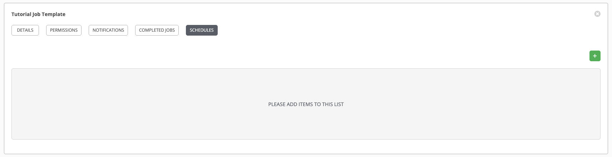
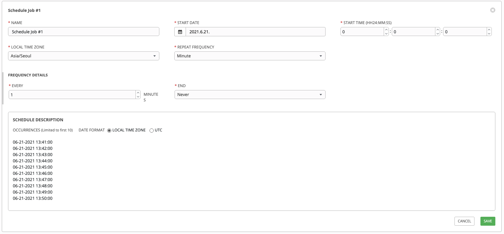

# Schedule Job
> 등록된 Job Template 을 사용하여 Schedule Job 으로 동작한다.  
> Menu > Template > <Job Tempalte 선택> > Schedule >   
> 기본 UTC 기준으로 동작하며, Local Time Zone 으로 변경해서 수행이 가능하다.

 

> 등록된 Schedule Job 실행 확인.
> Menu > Jobs  
