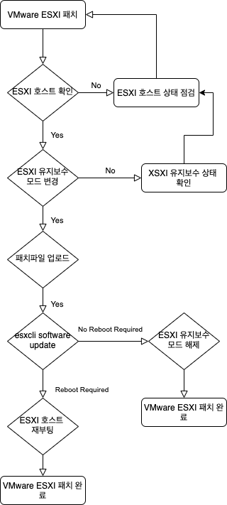
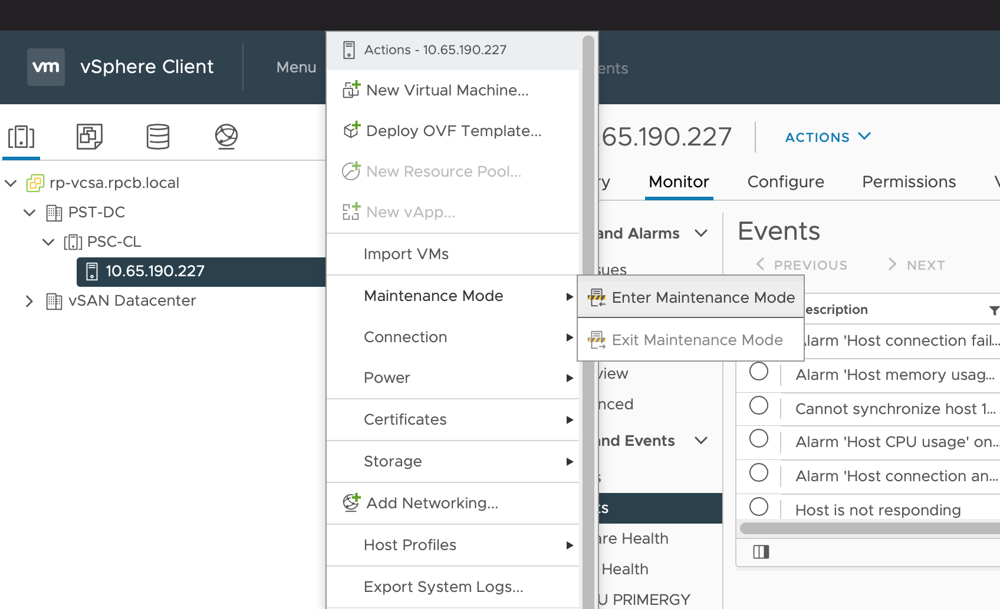
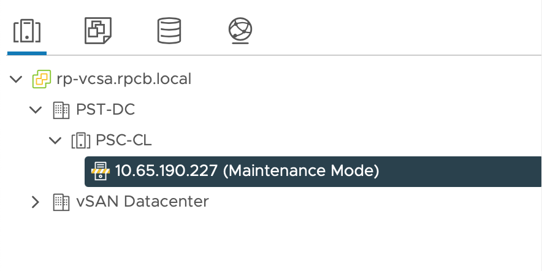

# VMWARAE



## 1. Check Status Vcenter XSXI Hosts 
```
ok: [localhost] => {
    "msg": {
        "ansible_all_ipv4_addresses": [
            "10.65.190.227"
        ], 
        "ansible_bios_date": "2020-12-24T00:00:00+00:00", 
        "ansible_bios_version": "VMW71.00V.17369862.B64.2012240522", 
        "ansible_datastore": [
            {
                "free": "69.73 GB", 
                "name": "datastore1", 
                "total": "71.75 GB"
            }
        ], 
        "ansible_distribution": "VMware ESXi", 
        "ansible_distribution_build": "17551050", 
        "ansible_distribution_version": "7.0.1", 
        "ansible_hostname": "10.65.190.227", 
        "ansible_in_maintenance_mode": false, 
        "ansible_interfaces": [
            "vmk0"
        ], 
        "ansible_memfree_mb": 6962, 
        "ansible_memtotal_mb": 8186, 
        "ansible_os_type": "vmnix-x86", 
        "ansible_processor": "Intel(R) Xeon(R) Gold 5218B CPU @ 2.30GHz", 
        "ansible_processor_cores": 4, 
        "ansible_processor_count": 2, 
        "ansible_processor_vcpus": 4, 
        "ansible_product_name": "VMware7,1", 
        "ansible_product_serial": "VMware-42 2b 30 11 1b ca 66 f0-31 95 00 04 6f c0 3f e5", 
        "ansible_system_vendor": "VMware, Inc.", 
        "ansible_uptime": 59, 
        "ansible_uuid": "11302b42-ca1b-f066-3195-00046fc03fe5", 
        "ansible_vmk0": {
            "device": "vmk0", 
            "ipv4": {
                "address": "10.65.190.227", 
                "netmask": "255.255.255.0"
            }, 
            "macaddress": "00:50:56:ab:e2:b1", 
            "mtu": 1500
        }, 
        "cluster": "PSC-CL", 
        "host_date_time": {}, 
        "vsan_cluster_uuid": null, 
        "vsan_health": "unknown", 
        "vsan_node_uuid": null
    }
}
```

## 2. Enter VSAN-Compliant Maintenance Mode]
``` 
ok: [localhost] => {
    "msg": {
        "changed": true, 
        "failed": false, 
        "hostname": "10.65.190.227", 
        "hostsystem": "'vim.HostSystem:host-9207'", 
        "msg": "Host 10.65.190.227 entered maintenance mode", 
        "status": "ENTER"
    }
}
```




## 3. Check Status Vcenter XSXI Hosts 
```
ok: [localhost] => {
    "msg": {
        "ansible_all_ipv4_addresses": [
            "10.65.190.227"
        ], 
        "ansible_bios_date": "2020-12-24T00:00:00+00:00", 
        "ansible_bios_version": "VMW71.00V.17369862.B64.2012240522", 
        "ansible_datastore": [
            {
                "free": "69.73 GB", 
                "name": "datastore1", 
                "total": "71.75 GB"
            }
        ], 
        "ansible_distribution": "VMware ESXi", 
        "ansible_distribution_build": "17551050", 
        "ansible_distribution_version": "7.0.1", 
        "ansible_hostname": "10.65.190.227", 
        "ansible_in_maintenance_mode": true, 
        "ansible_interfaces": [
            "vmk0"
        ], 
        "ansible_memfree_mb": 6933, 
        "ansible_memtotal_mb": 8186, 
        "ansible_os_type": "vmnix-x86", 
        "ansible_processor": "Intel(R) Xeon(R) Gold 5218B CPU @ 2.30GHz", 
        "ansible_processor_cores": 4, 
        "ansible_processor_count": 2, 
        "ansible_processor_vcpus": 4, 
        "ansible_product_name": "VMware7,1", 
        "ansible_product_serial": "VMware-42 2b 30 11 1b ca 66 f0-31 95 00 04 6f c0 3f e5", 
        "ansible_system_vendor": "VMware, Inc.", 
        "ansible_uptime": 239, 
        "ansible_uuid": "11302b42-ca1b-f066-3195-00046fc03fe5", 
        "ansible_vmk0": {
            "device": "vmk0", 
            "ipv4": {
                "address": "10.65.190.227", 
                "netmask": "255.255.255.0"
            }, 
            "macaddress": "00:50:56:ab:e2:b1", 
            "mtu": 1500
        }, 
        "cluster": "PSC-CL", 
        "host_date_time": {}, 
        "vsan_cluster_uuid": null, 
        "vsan_health": "unknown", 
        "vsan_node_uuid": null
    }
}
```

## 4. Copy & Update XSXI Hosts
``` 
ok: [10.65.190.227] => {
    "msg": {
        "changed": true, 
        "cmd": "esxcli software component apply -d /vmfs/volumes/datastore1/Patch/VMware-ESXi-7.0U1d-17551050-depot.zip", 
        "delta": "0:00:32.660940", 
        "end": "2021-06-24 14:03:45.307450", 
        "failed": false, 
        "rc": 0, 
        "start": "2021-06-24 14:03:12.646510", 
        "stderr": "", 
        "stderr_lines": [], 
        "stdout": "Installation Result\n   Components Installed: Broadcom-ELX-IMA-plugin_12.0.1200.0-3vmw.701.0.0.16850804, Broadcom-ELX-brcmfcoe_12.0.1500.0-1vmw.701.0.0.16850804, Broadcom-ELX-brcmnvmefc_12.6.278.10-3vmw.701.0.0.16850804, Broadcom-ELX-lpfc_12.6.278.10-8vmw.701.0.0.16850804, Broadcom-bnxt-Net-RoCE_216.0.0.0-1vmw.701.0.0.16850804, Broadcom-elxiscsi_12.0.1200.0-2vmw.701.0.0.16850804, Broadcom-elxnet_12.0.1250.0-5vmw.701.0.0.16850804, Broadcom-lpnic_11.4.62.0-1vmw.701.0.0.16850804, Broadcom-lsi-mr3_7.712.51.00-1vmw.701.0.0.16850804, Broadcom-lsi-msgpt2_20.00.06.00-3vmw.701.0.0.16850804, Broadcom-lsi-msgpt35_13.00.13.00-2vmw.701.0.0.16850804, Broadcom-lsi-msgpt3_17.00.10.00-2vmw.701.0.0.16850804, Broadcom-lsiv2-drivers-plugin_1.0.0-4vmw.701.0.0.16850804, Broadcom-ntg3_4.1.5.0-0vmw.701.0.0.16850804, Cisco-nenic_1.0.29.0-2vmw.701.0.0.16850804, Cisco-nfnic_4.0.0.44-2vmw.701.0.0.16850804, ESXi_7.0.1-0.30.17551050, HPE-hpv2-hpsa-plugin_1.0.0-3vmw.701.0.0.16850804, HPE-nhpsa_70.0051.0.100-2vmw.701.0.25.17325551, Intel-NVMe-Vol-Mgmt-Dev-Plugin_1.0.0-2vmw.701.0.0.16850804, Intel-SCU-rste_2.0.2.0088-7vmw.701.0.0.16850804, Intel-Volume-Mgmt-Device_2.0.0.1055-5vmw.701.0.0.16850804, Intel-i40en_1.8.1.123-1vmw.701.0.0.16850804, Intel-i40iwn_1.1.2.6-1vmw.701.0.0.16850804, Intel-igbn_0.1.1.0-7vmw.701.0.0.16850804, Intel-ixgben_1.7.1.28-1vmw.701.0.0.16850804, Intel-ne1000_0.8.4-11vmw.701.0.0.16850804, MRVL-E3-Ethernet-iSCSI-FCoE_1.0.0.0-1vmw.701.0.0.16850804, MRVL-E3-Ethernet_1.1.0.11-1vmw.701.0.0.16850804, MRVL-E4-CNA-Driver-Bundle_1.0.0.0-1vmw.701.0.0.16850804, MRVL-QLogic-FC_4.0.3.0-17vmw.701.0.0.16850804, Mellanox-nmlx4_3.19.16.8-2vmw.701.0.0.16850804, Mellanox-nmlx5_4.19.16.8-2vmw.701.0.0.16850804, Microchip-smartpqi_70.4000.0.100-4vmw.701.0.25.17325551, Microchip-smartpqiv2-plugin_1.0.0-4vmw.701.0.0.16850804, Micron-mtip32xx-native_3.9.8-1vmw.701.0.0.16850804, Solarflare-NIC_2.4.0.0010-15vmw.701.0.0.16850804, VMware-NVMe-PCIe_1.2.3.9-2vmw.701.0.0.16850804, VMware-NVMeoF-RDMA_1.0.1.2-1vmw.701.0.20.17325020, VMware-VM-Tools_11.1.1.16303738-16850804, VMware-ahci_2.0.5-2vmw.701.0.0.16850804, VMware-icen_1.0.0.9-1vmw.701.0.0.16850804, VMware-iser_1.1.0.1-1vmw.701.0.0.16850804, VMware-nvme-pcie-plugin_1.0.0-1vmw.701.0.0.16850804, VMware-nvme-plugin_1.2.0.38-1vmw.701.0.0.16850804, VMware-nvmxnet3-ens_2.0.0.22-1vmw.701.0.0.16850804, VMware-nvmxnet3_2.0.0.30-1vmw.701.0.0.16850804, VMware-oem-dell-plugin_1.0.0-1vmw.701.0.0.16850804, VMware-oem-hp-plugin_1.0.0-1vmw.701.0.0.16850804, VMware-oem-lenovo-plugin_1.0.0-1vmw.701.0.0.16850804, VMware-pvscsi_0.1-2vmw.701.0.0.16850804, VMware-vmkata_0.1-1vmw.701.0.25.17325551, VMware-vmkfcoe_1.0.0.2-1vmw.701.0.20.17325020, VMware-vmkusb_0.1-1vmw.701.0.25.17325551, esx-update_7.0.1-0.30.17551050\n   Components Removed: Broadcom-ELX-IMA-plugin_12.0.1200.0-2vmw.700.1.0.15843807, Broadcom-ELX-brcmfcoe_12.0.1500.0-1vmw.700.1.0.15843807, Broadcom-ELX-brcmnvmefc_12.4.293.2-3vmw.700.1.0.15843807, Broadcom-ELX-lpfc_12.4.293.3-5vmw.700.1.0.15843807, Broadcom-bnxt-Net-RoCE_216.0.0.0-1vmw.700.1.0.15843807, Broadcom-elxiscsi_12.0.1200.0-1vmw.700.1.0.15843807, Broadcom-elxnet_12.0.1250.0-5vmw.700.1.0.15843807, Broadcom-lpnic_11.4.62.0-1vmw.700.1.0.15843807, Broadcom-lsi-mr3_7.712.50.00-1vmw.700.1.0.15843807, Broadcom-lsi-msgpt2_20.00.06.00-2vmw.700.1.0.15843807, Broadcom-lsi-msgpt35_13.00.12.00-1vmw.700.1.0.15843807, Broadcom-lsi-msgpt3_17.00.10.00-1vmw.700.1.0.15843807, Broadcom-lsiv2-drivers-plugin_1.0.0-2vmw.700.1.0.15843807, Broadcom-ntg3_4.1.4.1-1vmw.700.1.0.15843807, Cisco-nenic_1.0.29.0-1vmw.700.1.0.15843807, Cisco-nfnic_4.0.0.44-1vmw.700.1.0.15843807, ESXi_7.0.0-1.25.16324942, HPE-hpv2-hpsa-plugin_1.0.0-2vmw.700.1.0.15843807, HPE-nhpsa_2.0.50-1vmw.700.1.0.15843807, Intel-NVMe-Vol-Mgmt-Dev-Plugin_1.0.0-2vmw.700.1.0.15843807, Intel-SCU-rste_2.0.2.0088-7vmw.700.1.0.15843807, Intel-Volume-Mgmt-Device_2.0.0.1055-3vmw.700.1.0.15843807, Intel-i40en_1.8.1.16-1vmw.700.1.0.15843807, Intel-i40iwn_1.1.2.5-1vmw.700.1.0.15843807, Intel-igbn_0.1.1.0-6vmw.700.1.0.15843807, Intel-ixgben_1.7.1.26-1vmw.700.1.0.15843807, Intel-ne1000_0.8.4-10vmw.700.1.0.15843807, MRVL-E3-Ethernet-iSCSI-FCoE_1.0.0.0-1vmw.700.1.0.15843807, MRVL-E3-Ethernet_1.1.0.11-1vmw.700.1.0.15843807, MRVL-E4-CNA-Driver-Bundle_1.0.0.0-1vmw.700.1.0.15843807, MRVL-QLogic-FC_4.0.1.0-3vmw.700.1.0.15843807, Mellanox-nmlx4_3.19.16.7-1vmw.700.1.0.15843807, Mellanox-nmlx5_4.19.16.7-1vmw.700.1.0.15843807, Microchip-smartpqi_1.0.4.3011-1vmw.700.1.0.15843807, Microchip-smartpqiv2-plugin_1.0.0-3vmw.700.1.0.15843807, Micron-mtip32xx-native_3.9.8-1vmw.700.1.0.15843807, Solarflare-NIC_2.0.0.1004-3vmw.700.1.0.15843807, VMware-NVMe-PCIe_1.2.2.14-1vmw.700.1.25.16324942, VMware-NVMeoF-RDMA_1.0.0.0-1vmw.700.1.0.15843807, VMware-VM-Tools_11.1.0.16036546-16321839, VMware-ahci_1.3.9-1vmw.700.1.0.15843807, VMware-iser_1.1.0.0-1vmw.700.1.0.15843807, VMware-nvme-pcie-plugin_1.0.0-1vmw.700.1.0.15843807, VMware-nvme-plugin_1.2.0.37-1vmw.700.1.0.15843807, VMware-nvmxnet3-ens_2.0.0.22-1vmw.700.1.0.15843807, VMware-nvmxnet3_2.0.0.30-1vmw.700.1.0.15843807, VMware-oem-dell-plugin_1.0.0-1vmw.700.1.0.15843807, VMware-oem-hp-plugin_1.0.0-1vmw.700.1.0.15843807, VMware-oem-lenovo-plugin_1.0.0-1vmw.700.1.0.15843807, VMware-pvscsi_0.1-2vmw.700.1.0.15843807, VMware-vmkata_0.1-1vmw.700.1.0.15843807, VMware-vmkfcoe_1.0.0.2-1vmw.700.1.0.15843807, VMware-vmkusb_0.1-1vmw.700.1.25.16324942, esx-update_7.0.0-1.25.16324942\n   Components Skipped: \n   Message: The update completed successfully, but the system needs to be rebooted for the changes to be effective.\n   Reboot Required: true", 
        "stdout_lines": [
            "Installation Result", 
            "   Components Installed: Broadcom-ELX-IMA-plugin_12.0.1200.0-3vmw.701.0.0.16850804, Broadcom-ELX-brcmfcoe_12.0.1500.0-1vmw.701.0.0.16850804, Broadcom-ELX-brcmnvmefc_12.6.278.10-3vmw.701.0.0.16850804, Broadcom-ELX-lpfc_12.6.278.10-8vmw.701.0.0.16850804, Broadcom-bnxt-Net-RoCE_216.0.0.0-1vmw.701.0.0.16850804, Broadcom-elxiscsi_12.0.1200.0-2vmw.701.0.0.16850804, Broadcom-elxnet_12.0.1250.0-5vmw.701.0.0.16850804, Broadcom-lpnic_11.4.62.0-1vmw.701.0.0.16850804, Broadcom-lsi-mr3_7.712.51.00-1vmw.701.0.0.16850804, Broadcom-lsi-msgpt2_20.00.06.00-3vmw.701.0.0.16850804, Broadcom-lsi-msgpt35_13.00.13.00-2vmw.701.0.0.16850804, Broadcom-lsi-msgpt3_17.00.10.00-2vmw.701.0.0.16850804, Broadcom-lsiv2-drivers-plugin_1.0.0-4vmw.701.0.0.16850804, Broadcom-ntg3_4.1.5.0-0vmw.701.0.0.16850804, Cisco-nenic_1.0.29.0-2vmw.701.0.0.16850804, Cisco-nfnic_4.0.0.44-2vmw.701.0.0.16850804, ESXi_7.0.1-0.30.17551050, HPE-hpv2-hpsa-plugin_1.0.0-3vmw.701.0.0.16850804, HPE-nhpsa_70.0051.0.100-2vmw.701.0.25.17325551, Intel-NVMe-Vol-Mgmt-Dev-Plugin_1.0.0-2vmw.701.0.0.16850804, Intel-SCU-rste_2.0.2.0088-7vmw.701.0.0.16850804, Intel-Volume-Mgmt-Device_2.0.0.1055-5vmw.701.0.0.16850804, Intel-i40en_1.8.1.123-1vmw.701.0.0.16850804, Intel-i40iwn_1.1.2.6-1vmw.701.0.0.16850804, Intel-igbn_0.1.1.0-7vmw.701.0.0.16850804, Intel-ixgben_1.7.1.28-1vmw.701.0.0.16850804, Intel-ne1000_0.8.4-11vmw.701.0.0.16850804, MRVL-E3-Ethernet-iSCSI-FCoE_1.0.0.0-1vmw.701.0.0.16850804, MRVL-E3-Ethernet_1.1.0.11-1vmw.701.0.0.16850804, MRVL-E4-CNA-Driver-Bundle_1.0.0.0-1vmw.701.0.0.16850804, MRVL-QLogic-FC_4.0.3.0-17vmw.701.0.0.16850804, Mellanox-nmlx4_3.19.16.8-2vmw.701.0.0.16850804, Mellanox-nmlx5_4.19.16.8-2vmw.701.0.0.16850804, Microchip-smartpqi_70.4000.0.100-4vmw.701.0.25.17325551, Microchip-smartpqiv2-plugin_1.0.0-4vmw.701.0.0.16850804, Micron-mtip32xx-native_3.9.8-1vmw.701.0.0.16850804, Solarflare-NIC_2.4.0.0010-15vmw.701.0.0.16850804, VMware-NVMe-PCIe_1.2.3.9-2vmw.701.0.0.16850804, VMware-NVMeoF-RDMA_1.0.1.2-1vmw.701.0.20.17325020, VMware-VM-Tools_11.1.1.16303738-16850804, VMware-ahci_2.0.5-2vmw.701.0.0.16850804, VMware-icen_1.0.0.9-1vmw.701.0.0.16850804, VMware-iser_1.1.0.1-1vmw.701.0.0.16850804, VMware-nvme-pcie-plugin_1.0.0-1vmw.701.0.0.16850804, VMware-nvme-plugin_1.2.0.38-1vmw.701.0.0.16850804, VMware-nvmxnet3-ens_2.0.0.22-1vmw.701.0.0.16850804, VMware-nvmxnet3_2.0.0.30-1vmw.701.0.0.16850804, VMware-oem-dell-plugin_1.0.0-1vmw.701.0.0.16850804, VMware-oem-hp-plugin_1.0.0-1vmw.701.0.0.16850804, VMware-oem-lenovo-plugin_1.0.0-1vmw.701.0.0.16850804, VMware-pvscsi_0.1-2vmw.701.0.0.16850804, VMware-vmkata_0.1-1vmw.701.0.25.17325551, VMware-vmkfcoe_1.0.0.2-1vmw.701.0.20.17325020, VMware-vmkusb_0.1-1vmw.701.0.25.17325551, esx-update_7.0.1-0.30.17551050", 
            "   Components Removed: Broadcom-ELX-IMA-plugin_12.0.1200.0-2vmw.700.1.0.15843807, Broadcom-ELX-brcmfcoe_12.0.1500.0-1vmw.700.1.0.15843807, Broadcom-ELX-brcmnvmefc_12.4.293.2-3vmw.700.1.0.15843807, Broadcom-ELX-lpfc_12.4.293.3-5vmw.700.1.0.15843807, Broadcom-bnxt-Net-RoCE_216.0.0.0-1vmw.700.1.0.15843807, Broadcom-elxiscsi_12.0.1200.0-1vmw.700.1.0.15843807, Broadcom-elxnet_12.0.1250.0-5vmw.700.1.0.15843807, Broadcom-lpnic_11.4.62.0-1vmw.700.1.0.15843807, Broadcom-lsi-mr3_7.712.50.00-1vmw.700.1.0.15843807, Broadcom-lsi-msgpt2_20.00.06.00-2vmw.700.1.0.15843807, Broadcom-lsi-msgpt35_13.00.12.00-1vmw.700.1.0.15843807, Broadcom-lsi-msgpt3_17.00.10.00-1vmw.700.1.0.15843807, Broadcom-lsiv2-drivers-plugin_1.0.0-2vmw.700.1.0.15843807, Broadcom-ntg3_4.1.4.1-1vmw.700.1.0.15843807, Cisco-nenic_1.0.29.0-1vmw.700.1.0.15843807, Cisco-nfnic_4.0.0.44-1vmw.700.1.0.15843807, ESXi_7.0.0-1.25.16324942, HPE-hpv2-hpsa-plugin_1.0.0-2vmw.700.1.0.15843807, HPE-nhpsa_2.0.50-1vmw.700.1.0.15843807, Intel-NVMe-Vol-Mgmt-Dev-Plugin_1.0.0-2vmw.700.1.0.15843807, Intel-SCU-rste_2.0.2.0088-7vmw.700.1.0.15843807, Intel-Volume-Mgmt-Device_2.0.0.1055-3vmw.700.1.0.15843807, Intel-i40en_1.8.1.16-1vmw.700.1.0.15843807, Intel-i40iwn_1.1.2.5-1vmw.700.1.0.15843807, Intel-igbn_0.1.1.0-6vmw.700.1.0.15843807, Intel-ixgben_1.7.1.26-1vmw.700.1.0.15843807, Intel-ne1000_0.8.4-10vmw.700.1.0.15843807, MRVL-E3-Ethernet-iSCSI-FCoE_1.0.0.0-1vmw.700.1.0.15843807, MRVL-E3-Ethernet_1.1.0.11-1vmw.700.1.0.15843807, MRVL-E4-CNA-Driver-Bundle_1.0.0.0-1vmw.700.1.0.15843807, MRVL-QLogic-FC_4.0.1.0-3vmw.700.1.0.15843807, Mellanox-nmlx4_3.19.16.7-1vmw.700.1.0.15843807, Mellanox-nmlx5_4.19.16.7-1vmw.700.1.0.15843807, Microchip-smartpqi_1.0.4.3011-1vmw.700.1.0.15843807, Microchip-smartpqiv2-plugin_1.0.0-3vmw.700.1.0.15843807, Micron-mtip32xx-native_3.9.8-1vmw.700.1.0.15843807, Solarflare-NIC_2.0.0.1004-3vmw.700.1.0.15843807, VMware-NVMe-PCIe_1.2.2.14-1vmw.700.1.25.16324942, VMware-NVMeoF-RDMA_1.0.0.0-1vmw.700.1.0.15843807, VMware-VM-Tools_11.1.0.16036546-16321839, VMware-ahci_1.3.9-1vmw.700.1.0.15843807, VMware-iser_1.1.0.0-1vmw.700.1.0.15843807, VMware-nvme-pcie-plugin_1.0.0-1vmw.700.1.0.15843807, VMware-nvme-plugin_1.2.0.37-1vmw.700.1.0.15843807, VMware-nvmxnet3-ens_2.0.0.22-1vmw.700.1.0.15843807, VMware-nvmxnet3_2.0.0.30-1vmw.700.1.0.15843807, VMware-oem-dell-plugin_1.0.0-1vmw.700.1.0.15843807, VMware-oem-hp-plugin_1.0.0-1vmw.700.1.0.15843807, VMware-oem-lenovo-plugin_1.0.0-1vmw.700.1.0.15843807, VMware-pvscsi_0.1-2vmw.700.1.0.15843807, VMware-vmkata_0.1-1vmw.700.1.0.15843807, VMware-vmkfcoe_1.0.0.2-1vmw.700.1.0.15843807, VMware-vmkusb_0.1-1vmw.700.1.25.16324942, esx-update_7.0.0-1.25.16324942", 
            "   Components Skipped: ", 
            "   Message: The update completed successfully, but the system needs to be rebooted for the changes to be effective.", 
            "   Reboot Required: true"
        ]
    }
}
```

## 5. Reboot & Check Status XSXI Hosts
``` 

```