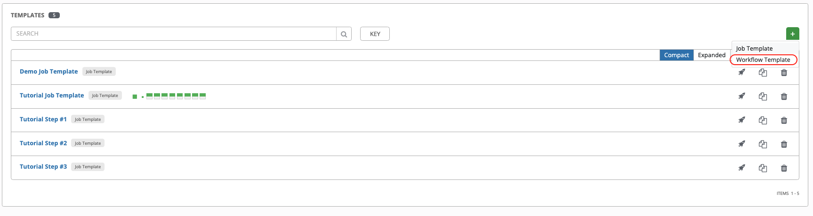
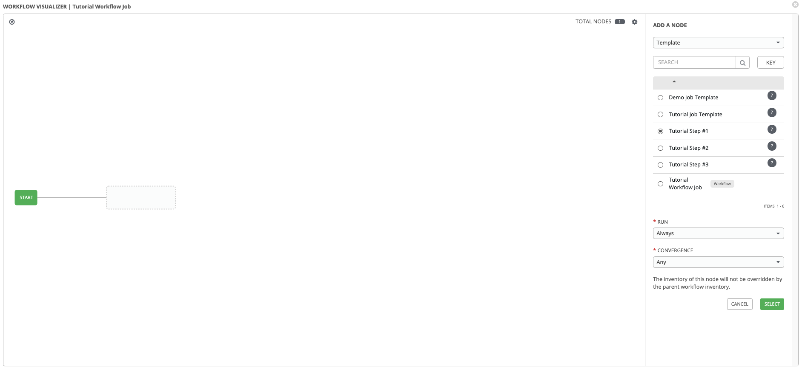

# Tower Workflow

> **ℹ️ Info**: For your information!  
> 독립적인 Job Template 을 연결하여 Workflow로 구성한다.

> Menu > Template  > Workflow Templte  
> 등록된 Job Template 을 연결하여 Workflow Job 을 생성한다.   
> Tutorial 에서는 Step #1 ~ Step #3 까지의 Job Template 을 미리 생성해서 사용한다.

> Workflow 스탭 성공/실패시 다음 스탭을 결정할 수 있다. 

> 동시에 실행하는 WorkFlow를 만들 수 있다.

> Workflow Job 실행시 Step 별로 진행상황이 표시된다.

> **:link: Referer** :  
> https://docs.ansible.com/ansible-tower/latest/html/userguide/workflows.html