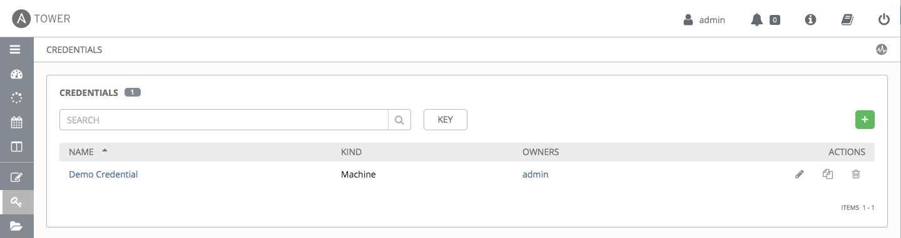
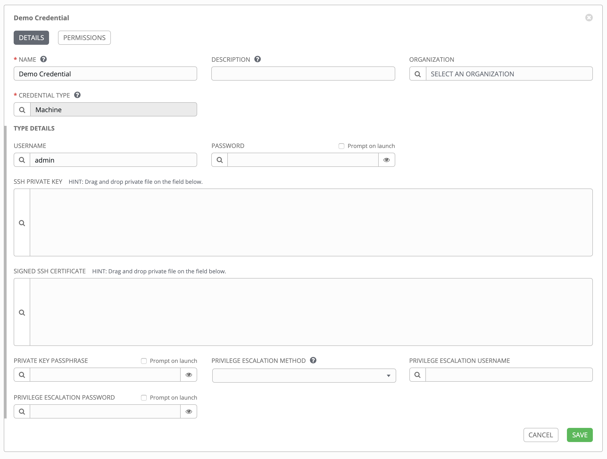

# Ansiblde Tower 데모 준비

> Ansible Tower 튜토리얼을 진행하기 위한 사전 준비:  
> 사용자 관리 > Organizations, Teams, Users 관리  
> 작업 관리 > Inventory, Credentals, Projects, Job Template 관리  

# 1. 작업 관리

## 1. Inventory 관리
> 작업 대상 노드의 집합으로 그룹,호스트를 관리 할 수 있다.

### 1. Inventory 등록

> Menu > Inventories > 

### 2. Group 등록 

## 2. Credentals 관리
> 작업 노드에 대한 인증을 하기위한 관리 도구이다.  
> 기본 OS 계정 정보를 포함한 Machine 인증, AWS, GCP 등의 다양한 모듈을 제공한다.

### 1. Credentals 등록

> Menu > Credentials

> Credentials > Demo Credential

> Creentials > Create Credentials

> Credentails > Create Credentials > CREDENTIAL TYPE

### 2. 지원하는 Credential Type

> **:link: Referer** : 
> https://docs.ansible.com/ansible-tower/latest/html/userguide/credentials.htmSD
- Amazon Web Services
- Ansible Galaxy/Automation Hub API Token
- Ansible Tower
- GitHub Personal Access Token
- GitLab Personal Access Token
- Google Compute Engine
- Insights
- Machine
- Microsoft Azure Resource Manager
- Network
- OpenShift or Kubernetes API Bearer Token
- OpenStack
- Red Hat Satellite 6
- Red Hat Virtualization
- Source Control
- Vault
- VMware vCenter

## 3. Projects 관리

### 1. Project 등록

## 4. Job Template 관리

### 1. Job Template 등록

# 2. 사용자 관리

## 1. Organizations 관리
> Ansible Tower 에서 가장 높은 관리 조직으로, Users, Teams, Projects 및 Inventories 의 모음이다.

## 2. Teams 관리

## 3. Users 관리