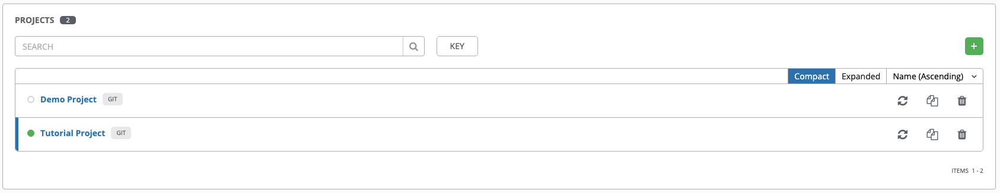

# Ansiblde Tower 데모 준비

> Ansible Tower 튜토리얼을 진행하기 위한 사전 준비:  
> 사용자 관리 > Organizations, Teams, Users 관리  
> 작업 관리 > Inventory, Credentals, Projects, Job Template 관리  

# 1. 사용자 관리

## 1. Organizations 관리
> Ansible Tower 에서 가장 높은 관리 조직으로, Users, Teams, Projects 및 Inventories 의 모음이다.

### 1. Organizations 등록

> Menu > Organizations > 

## 2. Teams 관리

> Menu > Teams >   
> Organization 에 속한 Team 을 등록한다.

## 3. Users 관리

> Menu > Users >  
> Organization 에 속한 User 를 등록한다.

## 4. Team 설정

> Menu > TEAMS > <TEAM이름> 수정 > USERS >   
> 상단에 USERS 로 이동후 사용자 추가

## 5. Permission 설정

> Organizations 상단 PERMISSIONS 에서 Team 또는 User 별 Role(Admin, Execute, Project Admin, Inventory Admin, ...) 설정이 가능하다.
> Teams, Users 상단 PERMISSIONS 에서 리소스별(Job Templates, PROJECTS ,INVENTORIES, ...) 접근 권한 설정이 가능하다.

- Organizations User Role 설정

- Organizations Team Role 설정

- Teams,Users 리소스별 권한

# 2. 작업 관리

## 1. Inventory 관리
> 작업 대상 노드의 집합으로 그룹,호스트를 관리 할 수 있다.

### 1. Inventory 등록

> Menu > Inventories   
> Inventory 선택 후 상단 Permission 에서 Team 또는 User 별 Role(Admin,Update,Ad Hoc, Use, Read) 설정이 가능하다.

### 3. Hosts 등록 

> Inventory 선택 > Hosts   
> Inventories 의 Hosts 을 관리한다.

 
 

### 2. Group 등록 

> Inventory 선택 > Groups   
> Inventories 의 Group 을 관리한다.

 

> Inventory 선택 > Groups > Group 선택 > Hosts,Groups

> Inventories > Inventory 선택 > Hosts

## 2. Credentals 관리

> Menu > Credentials   
> 작업 노드에 대한 인증을 하기위한 관리 도구이다.  
> 기본 OS 계정 정보를 포함한 Machine 인증, AWS, GCP 등의 다양한 모듈을 제공한다.

### 1. Credentals 등록 
 

> Credentails > Create Credentials > CREDENTIAL TYPE

### 2. 지원하는 Credential Type

> **:link: Referer** : 
> https://docs.ansible.com/ansible-tower/latest/html/userguide/credentials.htmSD
- Amazon Web Services
- Ansible Galaxy/Automation Hub API Token
- Ansible Tower
- GitHub Personal Access Token
- GitLab Personal Access Token
- Google Compute Engine
- Insights
- Machine
- Microsoft Azure Resource Manager
- Network
- OpenShift or Kubernetes API Bearer Token
- OpenStack
- Red Hat Satellite 6
- Red Hat Virtualization
- Source Control
- Vault
- VMware vCenter

## 3. Projects 관리

> Job Template 에서 사용되는 playbook 목록을 Projects 로 구성한다.  
> SCM(Playbook 목록)은 Git,Svn,Manual 등 다양한 방법을 제공한다. Tutorial 에서는 github 를 이용한다.

### 1. Project 등록

> Menu > Projects   

## 4. Job Template 관리

> Job Template 은 Ansible Tower 에서 실행되는 최소 단위의 작업이다.  
> Job Template 으로 Schedule Job, Workflow Job 을 생성할 수 있다.

### 1. Job Template 등록

> Menu > Template   

### 2. Job Template 실행

> Menu > Template    

### 2. Schedule Job
> Menu > Template > <Job Tempalte 선택> Schedule
> 등록된 Job Template 을 사용하여 Schedule Job 으로 동작한다.

 

> Menu > Jobs  
> 등록된 Schedule Job 실행 확인.

### 3. WorkFlow Job

> Menu > Template  > Workflow Templte  
> 등록된 Job Template 을 연결하여 Workflow Job 을 생성한다.   
> Tutorial 에서는 Step #1 ~ Step #3 까지의 Job Template 을 미리 생성해서 사용한다.

